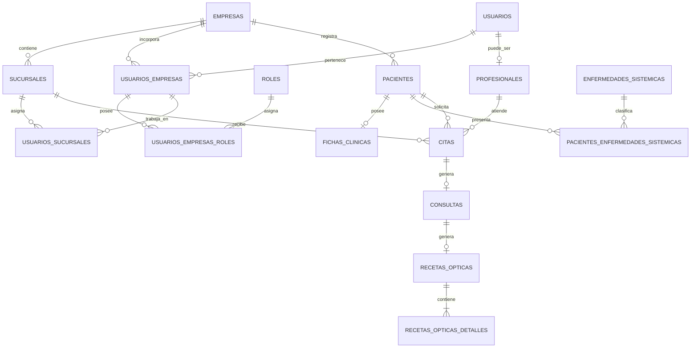
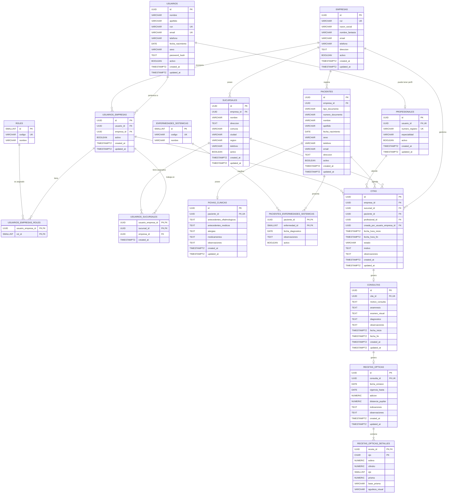

# Modelamiento de datos — VISIUM

## 1. Decisiones de diseño

### Usuarios, roles y profesionales

Los usuarios que ingresan al sistema se almacenan en la tabla `usuarios`.

Los distintos tipos de usuario se determinan mediante roles:

- `SUPER_ADMIN` — Dueños de Visium (plataforma / soporte)
- `JEFE` — Dueño de una o varias ópticas (antes `ADMIN`)
- `JEFE_SUCURSAL` — Jefe de una sucursal (solo sus sucursales)
- `RECEPCIONISTA`
- `PROFESIONAL`

No se crea una tabla `administradores`, porque un administrador no posee información adicional distinta a la de un usuario normal.

Los profesionales sí poseen una tabla separada porque necesitan información específica, como:

- Número de registro profesional.
- Especialidad.
- Estado profesional.

Por lo tanto:

```text
Dueño Visium
└── Usuario + rol SUPER_ADMIN

Dueño de óptica(s)
└── Usuario + rol JEFE (+ pertenencia en una o varias empresas)

Jefe de sucursal
└── Usuario + rol JEFE_SUCURSAL (+ usuarios_sucursales)

Recepcionista
└── Usuario + rol RECEPCIONISTA

Profesional
├── Usuario + rol PROFESIONAL
└── Registro adicional en profesionales

Paciente
└── Registro en pacientes
```

Los pacientes no son usuarios del sistema, salvo que en el futuro se implemente un portal de pacientes.

---

## 2. Convenciones
### Nombres

- Tablas en plural.
- Columnas en `snake_case`.
- Claves primarias con el nombre `id`.
- Claves foráneas con el formato `<entidad>_id`.

Ejemplo:
```text
usuario_id
empresa_id
sucursal_id
paciente_id
```

### Tipos de datos PostgreSQL

| Tipo de información | Tipo PostgreSQL |
|---|---|
| Identificadores principales | `UUID` |
| Fechas sin hora | `DATE` |
| Fechas con hora | `TIMESTAMPTZ` |
| Dinero o mediciones decimales | `NUMERIC` |
| Texto corto | `VARCHAR` |
| Texto largo | `TEXT` |
| Estados activos/inactivos | `BOOLEAN` |

Los UUID serán generados mediante:
```sql
gen_random_uuid()
```

Para utilizar esta función se necesita la extensión:

```sql
CREATE EXTENSION IF NOT EXISTS pgcrypto;
```

---
## 3. Diagrama de relaciones



---
# 4. Modelo de tablas
## 4.1. Empresas
Representa una empresa u óptica que utiliza VISIUM.

### Tabla `empresas`

| Columna | Tipo | Restricciones | Descripción |
|---|---|---|---|
| `id` | UUID | PK | Identificador de la empresa |
| `rut` | VARCHAR(12) | NOT NULL, UNIQUE | RUT de la empresa |
| `razon_social` | VARCHAR(150) | NOT NULL | Razón social |
| `nombre_fantasia` | VARCHAR(150) | NULL | Nombre comercial |
| `email` | VARCHAR(254) | NULL | Correo de contacto |
| `telefono` | VARCHAR(30) | NULL | Teléfono |
| `direccion` | TEXT | NULL | Dirección principal |
| `activo` | BOOLEAN | NOT NULL | Estado de la empresa |
| `created_at` | TIMESTAMPTZ | NOT NULL | Fecha de creación |
| `updated_at` | TIMESTAMPTZ | NOT NULL | Fecha de modificación |

---
## 4.2. Sucursales
Una empresa puede tener múltiples sucursales.

### Tabla `sucursales`

| Columna | Tipo | Restricciones | Descripción |
|---|---|---|---|
| `id` | UUID | PK | Identificador |
| `empresa_id` | UUID | FK, NOT NULL | Empresa propietaria |
| `nombre` | VARCHAR(120) | NOT NULL | Nombre de la sucursal |
| `direccion` | TEXT | NOT NULL | Dirección |
| `comuna` | VARCHAR(100) | NULL | Comuna |
| `ciudad` | VARCHAR(100) | NULL | Ciudad |
| `region` | VARCHAR(100) | NULL | Región |
| `telefono` | VARCHAR(30) | NULL | Teléfono |
| `activo` | BOOLEAN | NOT NULL | Estado de la sucursal |
| `created_at` | TIMESTAMPTZ | NOT NULL | Fecha de creación |
| `updated_at` | TIMESTAMPTZ | NOT NULL | Fecha de modificación |

Relación:
```text
EMPRESA 1 ─────── N SUCURSALES
```

---

## 4.3. Usuarios
Representa a las personas que pueden iniciar sesión en VISIUM.
### Tabla `usuarios`

| Columna | Tipo | Restricciones | Descripción |
|---|---|---|---|
| `id` | UUID | PK | Identificador |
| `nombre` | VARCHAR(100) | NOT NULL | Nombre |
| `apellido` | VARCHAR(100) | NOT NULL | Apellido |
| `run` | VARCHAR(12) | UNIQUE, NULL | RUN del usuario |
| `email` | VARCHAR(254) | NOT NULL | Correo utilizado para iniciar sesión |
| `telefono` | VARCHAR(30) | NULL | Teléfono |
| `fecha_nacimiento` | DATE | NULL | Fecha de nacimiento |
| `sexo` | VARCHAR(20) | NULL | Sexo registrado |
| `password_hash` | TEXT | NOT NULL | Contraseña codificada |
| `activo` | BOOLEAN | NOT NULL | Indica si puede ingresar |
| `created_at` | TIMESTAMPTZ | NOT NULL | Fecha de creación |
| `updated_at` | TIMESTAMPTZ | NOT NULL | Fecha de modificación |

---
## 4.4. Usuarios por empresa
Representa la pertenencia de un usuario a una empresa.

### Tabla `usuarios_empresas`

| Columna | Tipo | Restricciones | Descripción |
|---|---|---|---|
| `id` | UUID | PK | Identificador de la pertenencia |
| `usuario_id` | UUID | FK, NOT NULL | Usuario |
| `empresa_id` | UUID | FK, NOT NULL | Empresa |
| `activo` | BOOLEAN | NOT NULL | Estado en la empresa |
| `created_at` | TIMESTAMPTZ | NOT NULL | Fecha de incorporación |
| `updated_at` | TIMESTAMPTZ | NOT NULL | Fecha de modificación |

Restricción:
```text
UNIQUE(usuario_id, empresa_id)
```
Esto permite que una persona pueda pertenecer a más de una empresa.

Ejemplo:
```text
Matías → JEFE en Óptica A y Óptica B (ve ambas; el personal de A no ve B)
Ana → JEFE_SUCURSAL solo en Sucursal Centro de Óptica A
Matías → PROFESIONAL en Óptica B
```

---
## 4.5. Roles
### Tabla `roles`

| Columna | Tipo | Restricciones | Descripción |
|---|---|---|---|
| `id` | SMALLINT | PK | Identificador |
| `codigo` | VARCHAR(50) | NOT NULL, UNIQUE | Código utilizado por Spring Security |
| `nombre` | VARCHAR(100) | NOT NULL | Nombre descriptivo |

Roles iniciales:

| Código | Nombre |
|---|---|
| `SUPER_ADMIN` | Dueño Visium (plataforma) |
| `JEFE` | Jefe / Dueño de óptica |
| `JEFE_SUCURSAL` | Jefe de sucursal |
| `RECEPCIONISTA` | Recepcionista |
| `PROFESIONAL` | Profesional |

---
## 4.6. Roles de usuarios por empresa
### Tabla `usuarios_empresas_roles`

| Columna | Tipo | Restricciones | Descripción |
|---|---|---|---|
| `usuario_empresa_id` | UUID | PK, FK | Pertenencia del usuario |
| `rol_id` | SMALLINT | PK, FK | Rol asignado |

Clave primaria compuesta:
```text
PK(usuario_empresa_id, rol_id)
```

La asignación de roles se realiza dentro de una empresa.

---
## 4.7. Usuarios por sucursal
Representa las sucursales en las que puede trabajar un usuario.

### Tabla `usuarios_sucursales`

| Columna | Tipo | Restricciones | Descripción |
|---|---|---|---|
| `usuario_empresa_id` | UUID | PK, FK | Usuario perteneciente a la empresa |
| `sucursal_id` | UUID | PK, FK | Sucursal asignada |
| `empresa_id` | UUID | FK, NOT NULL | Empresa de ambas entidades |
| `created_at` | TIMESTAMPTZ | NOT NULL | Fecha de asignación |

Clave primaria compuesta:
```text
PK(usuario_empresa_id, sucursal_id)
```

Esta tabla es para trabajadores, no para pacientes.

> [!IMPORTANT]
> La sucursal visitada por un paciente se obtiene mediante sus citas.

---
## 4.8. Profesionales
Contiene información exclusiva de los profesionales.

### Tabla `profesionales`

| Columna | Tipo | Restricciones | Descripción |
|---|---|---|---|
| `id` | UUID | PK | Identificador profesional |
| `usuario_id` | UUID | FK, NOT NULL, UNIQUE | Usuario relacionado |
| `numero_registro` | VARCHAR(50) | NOT NULL, UNIQUE | Registro profesional |
| `especialidad` | VARCHAR(120) | NOT NULL | Especialidad |
| `activo` | BOOLEAN | NOT NULL | Estado profesional |
| `created_at` | TIMESTAMPTZ | NOT NULL | Fecha de creación |
| `updated_at` | TIMESTAMPTZ | NOT NULL | Fecha de modificación |

Relación:
```text
USUARIO 1 ─────── 0..1 PROFESIONAL
```

Todo profesional es un usuario, pero no todo usuario es un profesional.

Para que un profesional pueda atender debe cumplir:

1. Tener un registro en `profesionales`.
2. Tener el rol `PROFESIONAL`.
3. Pertenecer a la empresa.
4. Estar asignado a la sucursal.
5. Estar activo.

---
## 4.9. Pacientes
Representa a las personas atendidas en una empresa.

### Tabla `pacientes`

| Columna | Tipo | Restricciones | Descripción |
|---|---|---|---|
| `id` | UUID | PK | Identificador |
| `empresa_id` | UUID | FK, NOT NULL | Empresa que registra al paciente |
| `tipo_documento` | VARCHAR(20) | NOT NULL | RUN, PASAPORTE u OTRO |
| `numero_documento` | VARCHAR(50) | NULL | Número de documento |
| `nombre` | VARCHAR(100) | NOT NULL | Nombre |
| `apellido` | VARCHAR(100) | NOT NULL | Apellido |
| `fecha_nacimiento` | DATE | NULL | Fecha de nacimiento |
| `sexo` | VARCHAR(20) | NULL | Sexo |
| `telefono` | VARCHAR(30) | NULL | Teléfono |
| `email` | VARCHAR(254) | NULL | Correo |
| `direccion` | TEXT | NULL | Dirección |
| `activo` | BOOLEAN | NOT NULL | Estado |
| `created_at` | TIMESTAMPTZ | NOT NULL | Fecha de creación |
| `updated_at` | TIMESTAMPTZ | NOT NULL | Fecha de modificación |

El documento debe ser único dentro de una empresa.
```text
UNIQUE(empresa_id, tipo_documento, numero_documento)
```

Un paciente puede atenderse en diferentes sucursales sin crear una relación directa con ellas.

---
## 4.10. Fichas clínicas
Contiene los antecedentes generales y permanentes del paciente.

### Tabla `fichas_clinicas`

| Columna | Tipo | Restricciones | Descripción |
|---|---|---|---|
| `id` | UUID | PK | Identificador |
| `paciente_id` | UUID | FK, NOT NULL, UNIQUE | Paciente |
| `antecedentes_oftalmologicos` | TEXT | NULL | Antecedentes oftalmológicos |
| `antecedentes_medicos` | TEXT | NULL | Antecedentes médicos |
| `alergias` | TEXT | NULL | Alergias |
| `medicamentos` | TEXT | NULL | Medicamentos utilizados |
| `observaciones` | TEXT | NULL | Observaciones generales |
| `created_at` | TIMESTAMPTZ | NOT NULL | Fecha de creación |
| `updated_at` | TIMESTAMPTZ | NOT NULL | Fecha de modificación |

Relación:
```text
PACIENTE 1 ─────── 0..1 FICHA CLÍNICA
```

---
## 5.11. Enfermedades sistémicas
Catálogo de enfermedades sistémicas.

### Tabla `enfermedades_sistemicas`

| Columna | Tipo | Restricciones | Descripción |
|---|---|---|---|
| `id` | SMALLINT | PK | Identificador |
| `codigo` | VARCHAR(50) | NOT NULL, UNIQUE | Código |
| `nombre` | VARCHAR(100) | NOT NULL | Nombre |

Registros iniciales:
```text
DIABETES
HIPERTENSION
DISLIPIDEMIA
```

### Tabla `pacientes_enfermedades_sistemicas`

| Columna | Tipo | Restricciones | Descripción |
|---|---|---|---|
| `paciente_id` | UUID | PK, FK | Paciente |
| `enfermedad_id` | SMALLINT | PK, FK | Enfermedad |
| `fecha_diagnostico` | DATE | NULL | Fecha aproximada de diagnóstico |
| `observaciones` | TEXT | NULL | Información adicional |
| `activo` | BOOLEAN | NOT NULL | Estado del antecedente |

---
## 4.12. Citas
Representa una reserva de atención.

### Tabla `citas`

| Columna | Tipo | Restricciones | Descripción |
|---|---|---|---|
| `id` | UUID | PK | Identificador |
| `empresa_id` | UUID | FK, NOT NULL | Empresa |
| `sucursal_id` | UUID | FK, NOT NULL | Sucursal |
| `paciente_id` | UUID | FK, NOT NULL | Paciente |
| `profesional_id` | UUID | FK, NOT NULL | Profesional asignado |
| `creada_por_usuario_empresa_id` | UUID | FK, NOT NULL | Usuario que registró la cita |
| `fecha_hora_inicio` | TIMESTAMPTZ | NOT NULL | Inicio |
| `fecha_hora_fin` | TIMESTAMPTZ | NOT NULL | Fin |
| `estado` | VARCHAR(30) | NOT NULL | Estado de la cita |
| `motivo` | TEXT | NULL | Motivo indicado |
| `observaciones` | TEXT | NULL | Información adicional |
| `created_at` | TIMESTAMPTZ | NOT NULL | Fecha de creación |
| `updated_at` | TIMESTAMPTZ | NOT NULL | Fecha de modificación |

Estados permitidos:
```text
PENDIENTE
CONFIRMADA
ATENDIDA
CANCELADA
NO_ASISTIO
```

Una cita debe cumplir:

```text
fecha_hora_fin > fecha_hora_inicio
```

Relaciones:

```text
PACIENTE    1 ─────── N CITAS
PROFESIONAL 1 ─────── N CITAS
SUCURSAL    1 ─────── N CITAS
```
---
## 4.13. Consultas
Representa una atención clínica realizada.

### Tabla `consultas`

| Columna | Tipo | Restricciones | Descripción |
|---|---|---|---|
| `id` | UUID | PK | Identificador |
| `cita_id` | UUID | FK, NOT NULL, UNIQUE | Cita relacionada |
| `motivo_consulta` | TEXT | NULL | Motivo de consulta |
| `anamnesis` | TEXT | NULL | Información recopilada |
| `examen_visual` | TEXT | NULL | Resultado del examen |
| `diagnostico` | TEXT | NULL | Diagnóstico |
| `observaciones` | TEXT | NULL | Observaciones |
| `fecha_inicio` | TIMESTAMPTZ | NOT NULL | Inicio de atención |
| `fecha_fin` | TIMESTAMPTZ | NULL | Fin de atención |
| `created_at` | TIMESTAMPTZ | NOT NULL | Fecha de creación |
| `updated_at` | TIMESTAMPTZ | NOT NULL | Fecha de modificación |

Relación:

```text
CITA 1 ─────── 0..1 CONSULTA
```

Una cita cancelada o con inasistencia no genera una consulta.

---
## 4.14. Recetas ópticas
Representa una receta generada en una consulta.

### Tabla `recetas_opticas`

| Columna | Tipo | Restricciones | Descripción |
|---|---|---|---|
| `id` | UUID | PK | Identificador |
| `consulta_id` | UUID | FK, NOT NULL, UNIQUE | Consulta |
| `fecha_emision` | DATE | NOT NULL | Fecha de emisión |
| `vigencia_hasta` | DATE | NULL | Fecha de vencimiento |
| `adicion` | NUMERIC(4,2) | NULL | Adición única |
| `distancia_pupilar` | NUMERIC(5,2) | NULL | Distancia pupilar |
| `indicaciones` | TEXT | NULL | Indicaciones |
| `observaciones` | TEXT | NULL | Observaciones |
| `created_at` | TIMESTAMPTZ | NOT NULL | Fecha de creación |
| `updated_at` | TIMESTAMPTZ | NOT NULL | Fecha de modificación |

Relación:

```text
CONSULTA 1 ─────── 0..1 RECETA ÓPTICA
```

---
## 4.15. Detalles de receta por ojo
Contiene las mediciones del ojo derecho y del ojo izquierdo.

### Tabla `recetas_opticas_detalles`

| Columna | Tipo | Restricciones | Descripción |
|---|---|---|---|
| `receta_id` | UUID | PK, FK | Receta |
| `ojo` | CHAR(2) | PK | `OD` u `OI` |
| `esfera` | NUMERIC(5,2) | NULL | Valor de esfera |
| `cilindro` | NUMERIC(5,2) | NULL | Valor de cilindro |
| `eje` | SMALLINT | NULL | Eje entre 0 y 180 |
| `prisma` | NUMERIC(5,2) | NULL | Prisma |
| `base_prisma` | VARCHAR(20) | NULL | Dirección de la base |
| `agudeza_visual` | VARCHAR(20) | NULL | Agudeza visual |

Clave primaria:
```text
PK(receta_id, ojo)
```

Cada receta debe tener como máximo dos registros:

```text
OD → ojo derecho
OI → ojo izquierdo
```

La aplicación debe validar que una receta completa posea ambos ojos.

---
# 5. DER
## Diagrama entidad-relación



---
# 6. Script PostgreSQL
```sql
CREATE EXTENSION IF NOT EXISTS pgcrypto;

CREATE TABLE empresas (
    id UUID PRIMARY KEY DEFAULT gen_random_uuid(),
    rut VARCHAR(12) NOT NULL UNIQUE,
    razon_social VARCHAR(150) NOT NULL,
    nombre_fantasia VARCHAR(150),
    email VARCHAR(254),
    telefono VARCHAR(30),
    direccion TEXT,
    activo BOOLEAN NOT NULL DEFAULT TRUE,
    created_at TIMESTAMPTZ NOT NULL DEFAULT NOW(),
    updated_at TIMESTAMPTZ NOT NULL DEFAULT NOW()
);

CREATE UNIQUE INDEX uq_empresas_email
    ON empresas (LOWER(email))
    WHERE email IS NOT NULL;


CREATE TABLE sucursales (
    id UUID PRIMARY KEY DEFAULT gen_random_uuid(),
    empresa_id UUID NOT NULL,
    nombre VARCHAR(120) NOT NULL,
    direccion TEXT NOT NULL,
    comuna VARCHAR(100),
    ciudad VARCHAR(100),
    region VARCHAR(100),
    telefono VARCHAR(30),
    activo BOOLEAN NOT NULL DEFAULT TRUE,
    created_at TIMESTAMPTZ NOT NULL DEFAULT NOW(),
    updated_at TIMESTAMPTZ NOT NULL DEFAULT NOW(),

    CONSTRAINT fk_sucursales_empresa
        FOREIGN KEY (empresa_id)
        REFERENCES empresas (id),

    CONSTRAINT uq_sucursales_empresa_nombre
        UNIQUE (empresa_id, nombre),

    CONSTRAINT uq_sucursales_id_empresa
        UNIQUE (id, empresa_id)
);


CREATE TABLE usuarios (
    id UUID PRIMARY KEY DEFAULT gen_random_uuid(),
    nombre VARCHAR(100) NOT NULL,
    apellido VARCHAR(100) NOT NULL,
    run VARCHAR(12),
    email VARCHAR(254) NOT NULL,
    telefono VARCHAR(30),
    fecha_nacimiento DATE,
    sexo VARCHAR(20),
    password_hash TEXT NOT NULL,
    activo BOOLEAN NOT NULL DEFAULT TRUE,
    created_at TIMESTAMPTZ NOT NULL DEFAULT NOW(),
    updated_at TIMESTAMPTZ NOT NULL DEFAULT NOW(),

    CONSTRAINT ck_usuarios_sexo
        CHECK (
            sexo IS NULL
            OR sexo IN ('MASCULINO', 'FEMENINO', 'OTRO', 'NO_INFORMA')
        )
);

CREATE UNIQUE INDEX uq_usuarios_email
    ON usuarios (LOWER(email));

CREATE UNIQUE INDEX uq_usuarios_run
    ON usuarios (run)
    WHERE run IS NOT NULL;


CREATE TABLE usuarios_empresas (
    id UUID PRIMARY KEY DEFAULT gen_random_uuid(),
    usuario_id UUID NOT NULL,
    empresa_id UUID NOT NULL,
    activo BOOLEAN NOT NULL DEFAULT TRUE,
    created_at TIMESTAMPTZ NOT NULL DEFAULT NOW(),
    updated_at TIMESTAMPTZ NOT NULL DEFAULT NOW(),

    CONSTRAINT fk_usuarios_empresas_usuario
        FOREIGN KEY (usuario_id)
        REFERENCES usuarios (id),

    CONSTRAINT fk_usuarios_empresas_empresa
        FOREIGN KEY (empresa_id)
        REFERENCES empresas (id),

    CONSTRAINT uq_usuarios_empresas
        UNIQUE (usuario_id, empresa_id),

    CONSTRAINT uq_usuarios_empresas_id_empresa
        UNIQUE (id, empresa_id)
);


CREATE TABLE roles (
    id SMALLSERIAL PRIMARY KEY,
    codigo VARCHAR(50) NOT NULL UNIQUE,
    nombre VARCHAR(100) NOT NULL
);


CREATE TABLE usuarios_empresas_roles (
    usuario_empresa_id UUID NOT NULL,
    rol_id SMALLINT NOT NULL,

    PRIMARY KEY (usuario_empresa_id, rol_id),

    CONSTRAINT fk_usuarios_empresas_roles_usuario_empresa
        FOREIGN KEY (usuario_empresa_id)
        REFERENCES usuarios_empresas (id)
        ON DELETE CASCADE,

    CONSTRAINT fk_usuarios_empresas_roles_rol
        FOREIGN KEY (rol_id)
        REFERENCES roles (id)
);


CREATE TABLE usuarios_sucursales (
    usuario_empresa_id UUID NOT NULL,
    sucursal_id UUID NOT NULL,
    empresa_id UUID NOT NULL,
    created_at TIMESTAMPTZ NOT NULL DEFAULT NOW(),

    PRIMARY KEY (usuario_empresa_id, sucursal_id),

    CONSTRAINT fk_usuarios_sucursales_usuario_empresa
        FOREIGN KEY (usuario_empresa_id, empresa_id)
        REFERENCES usuarios_empresas (id, empresa_id)
        ON DELETE CASCADE,

    CONSTRAINT fk_usuarios_sucursales_sucursal
        FOREIGN KEY (sucursal_id, empresa_id)
        REFERENCES sucursales (id, empresa_id)
        ON DELETE CASCADE
);


CREATE TABLE profesionales (
    id UUID PRIMARY KEY DEFAULT gen_random_uuid(),
    usuario_id UUID NOT NULL UNIQUE,
    numero_registro VARCHAR(50) NOT NULL UNIQUE,
    especialidad VARCHAR(120) NOT NULL,
    activo BOOLEAN NOT NULL DEFAULT TRUE,
    created_at TIMESTAMPTZ NOT NULL DEFAULT NOW(),
    updated_at TIMESTAMPTZ NOT NULL DEFAULT NOW(),

    CONSTRAINT fk_profesionales_usuario
        FOREIGN KEY (usuario_id)
        REFERENCES usuarios (id)
);


CREATE TABLE pacientes (
    id UUID PRIMARY KEY DEFAULT gen_random_uuid(),
    empresa_id UUID NOT NULL,
    tipo_documento VARCHAR(20) NOT NULL DEFAULT 'RUN',
    numero_documento VARCHAR(50),
    nombre VARCHAR(100) NOT NULL,
    apellido VARCHAR(100) NOT NULL,
    fecha_nacimiento DATE,
    sexo VARCHAR(20),
    telefono VARCHAR(30),
    email VARCHAR(254),
    direccion TEXT,
    activo BOOLEAN NOT NULL DEFAULT TRUE,
    created_at TIMESTAMPTZ NOT NULL DEFAULT NOW(),
    updated_at TIMESTAMPTZ NOT NULL DEFAULT NOW(),

    CONSTRAINT fk_pacientes_empresa
        FOREIGN KEY (empresa_id)
        REFERENCES empresas (id),

    CONSTRAINT ck_pacientes_tipo_documento
        CHECK (
            tipo_documento IN ('RUN', 'PASAPORTE', 'OTRO')
        ),

    CONSTRAINT ck_pacientes_sexo
        CHECK (
            sexo IS NULL
            OR sexo IN ('MASCULINO', 'FEMENINO', 'OTRO', 'NO_INFORMA')
        ),

    CONSTRAINT uq_pacientes_id_empresa
        UNIQUE (id, empresa_id)
);

CREATE UNIQUE INDEX uq_pacientes_documento_empresa
    ON pacientes (
        empresa_id,
        tipo_documento,
        UPPER(numero_documento)
    )
    WHERE numero_documento IS NOT NULL;

CREATE INDEX idx_pacientes_empresa_apellido
    ON pacientes (empresa_id, apellido, nombre);


CREATE TABLE fichas_clinicas (
    id UUID PRIMARY KEY DEFAULT gen_random_uuid(),
    paciente_id UUID NOT NULL UNIQUE,
    antecedentes_oftalmologicos TEXT,
    antecedentes_medicos TEXT,
    alergias TEXT,
    medicamentos TEXT,
    observaciones TEXT,
    created_at TIMESTAMPTZ NOT NULL DEFAULT NOW(),
    updated_at TIMESTAMPTZ NOT NULL DEFAULT NOW(),

    CONSTRAINT fk_fichas_clinicas_paciente
        FOREIGN KEY (paciente_id)
        REFERENCES pacientes (id)
);


CREATE TABLE enfermedades_sistemicas (
    id SMALLSERIAL PRIMARY KEY,
    codigo VARCHAR(50) NOT NULL UNIQUE,
    nombre VARCHAR(100) NOT NULL
);


CREATE TABLE pacientes_enfermedades_sistemicas (
    paciente_id UUID NOT NULL,
    enfermedad_id SMALLINT NOT NULL,
    fecha_diagnostico DATE,
    observaciones TEXT,
    activo BOOLEAN NOT NULL DEFAULT TRUE,

    PRIMARY KEY (paciente_id, enfermedad_id),

    CONSTRAINT fk_paciente_enfermedad_paciente
        FOREIGN KEY (paciente_id)
        REFERENCES pacientes (id)
        ON DELETE CASCADE,

    CONSTRAINT fk_paciente_enfermedad_enfermedad
        FOREIGN KEY (enfermedad_id)
        REFERENCES enfermedades_sistemicas (id)
);


CREATE TABLE citas (
    id UUID PRIMARY KEY DEFAULT gen_random_uuid(),
    empresa_id UUID NOT NULL,
    sucursal_id UUID NOT NULL,
    paciente_id UUID NOT NULL,
    profesional_id UUID NOT NULL,
    creada_por_usuario_empresa_id UUID NOT NULL,
    fecha_hora_inicio TIMESTAMPTZ NOT NULL,
    fecha_hora_fin TIMESTAMPTZ NOT NULL,
    estado VARCHAR(30) NOT NULL DEFAULT 'PENDIENTE',
    motivo TEXT,
    observaciones TEXT,
    created_at TIMESTAMPTZ NOT NULL DEFAULT NOW(),
    updated_at TIMESTAMPTZ NOT NULL DEFAULT NOW(),

    CONSTRAINT fk_citas_sucursal
        FOREIGN KEY (sucursal_id, empresa_id)
        REFERENCES sucursales (id, empresa_id),

    CONSTRAINT fk_citas_paciente
        FOREIGN KEY (paciente_id, empresa_id)
        REFERENCES pacientes (id, empresa_id),

    CONSTRAINT fk_citas_profesional
        FOREIGN KEY (profesional_id)
        REFERENCES profesionales (id),

    CONSTRAINT fk_citas_usuario_creador
        FOREIGN KEY (
            creada_por_usuario_empresa_id,
            empresa_id
        )
        REFERENCES usuarios_empresas (id, empresa_id),

    CONSTRAINT ck_citas_fechas
        CHECK (fecha_hora_fin > fecha_hora_inicio),

    CONSTRAINT ck_citas_estado
        CHECK (
            estado IN (
                'PENDIENTE',
                'CONFIRMADA',
                'ATENDIDA',
                'CANCELADA',
                'NO_ASISTIO'
            )
        )
);

CREATE INDEX idx_citas_paciente_fecha
    ON citas (paciente_id, fecha_hora_inicio DESC);

CREATE INDEX idx_citas_profesional_fecha
    ON citas (profesional_id, fecha_hora_inicio);

CREATE INDEX idx_citas_sucursal_fecha
    ON citas (sucursal_id, fecha_hora_inicio);

CREATE INDEX idx_citas_empresa_estado
    ON citas (empresa_id, estado);


CREATE TABLE consultas (
    id UUID PRIMARY KEY DEFAULT gen_random_uuid(),
    cita_id UUID NOT NULL UNIQUE,
    motivo_consulta TEXT,
    anamnesis TEXT,
    examen_visual TEXT,
    diagnostico TEXT,
    observaciones TEXT,
    fecha_inicio TIMESTAMPTZ NOT NULL DEFAULT NOW(),
    fecha_fin TIMESTAMPTZ,
    created_at TIMESTAMPTZ NOT NULL DEFAULT NOW(),
    updated_at TIMESTAMPTZ NOT NULL DEFAULT NOW(),

    CONSTRAINT fk_consultas_cita
        FOREIGN KEY (cita_id)
        REFERENCES citas (id),

    CONSTRAINT ck_consultas_fechas
        CHECK (
            fecha_fin IS NULL
            OR fecha_fin >= fecha_inicio
        )
);


CREATE TABLE recetas_opticas (
    id UUID PRIMARY KEY DEFAULT gen_random_uuid(),
    consulta_id UUID NOT NULL UNIQUE,
    fecha_emision DATE NOT NULL DEFAULT CURRENT_DATE,
    vigencia_hasta DATE,
    adicion NUMERIC(4,2),
    distancia_pupilar NUMERIC(5,2),
    indicaciones TEXT,
    observaciones TEXT,
    created_at TIMESTAMPTZ NOT NULL DEFAULT NOW(),
    updated_at TIMESTAMPTZ NOT NULL DEFAULT NOW(),

    CONSTRAINT fk_recetas_opticas_consulta
        FOREIGN KEY (consulta_id)
        REFERENCES consultas (id),

    CONSTRAINT ck_recetas_vigencia
        CHECK (
            vigencia_hasta IS NULL
            OR vigencia_hasta >= fecha_emision
        )
);


CREATE TABLE recetas_opticas_detalles (
    receta_id UUID NOT NULL,
    ojo CHAR(2) NOT NULL,
    esfera NUMERIC(5,2),
    cilindro NUMERIC(5,2),
    eje SMALLINT,
    prisma NUMERIC(5,2),
    base_prisma VARCHAR(20),
    agudeza_visual VARCHAR(20),

    PRIMARY KEY (receta_id, ojo),

    CONSTRAINT fk_recetas_detalles_receta
        FOREIGN KEY (receta_id)
        REFERENCES recetas_opticas (id)
        ON DELETE CASCADE,

    CONSTRAINT ck_recetas_detalles_ojo
        CHECK (ojo IN ('OD', 'OI')),

    CONSTRAINT ck_recetas_detalles_eje
        CHECK (
            eje IS NULL
            OR eje BETWEEN 0 AND 180
        )
);
```

---

# 8. Datos iniciales

```sql
INSERT INTO roles (codigo, nombre)
VALUES
    ('SUPER_ADMIN', 'Dueño Visium (plataforma)'),
    ('JEFE', 'Jefe / Dueño de optica'),
    ('JEFE_SUCURSAL', 'Jefe de sucursal'),
    ('RECEPCIONISTA', 'Recepcionista'),
    ('PROFESIONAL', 'Profesional')
ON CONFLICT (codigo) DO NOTHING;


INSERT INTO enfermedades_sistemicas (codigo, nombre)
VALUES
    ('DIABETES', 'Diabetes'),
    ('HIPERTENSION', 'Hipertensión'),
    ('DISLIPIDEMIA', 'Dislipidemia')
ON CONFLICT (codigo) DO NOTHING;
```
